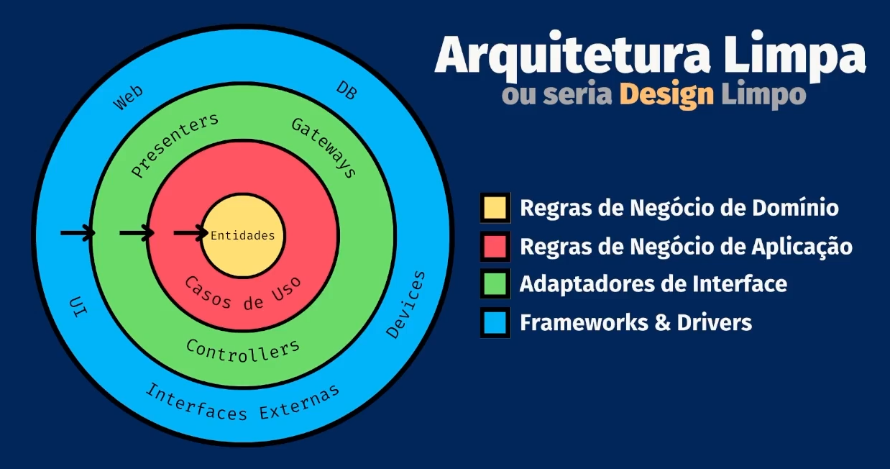

# Conceito

_Em geral, a palavra **"arquitetura"**_ é usada no contexto de algo em nível mais alto e que independe dos detalhes dos níveis mais baixos, enquanto **"design"** parece muitas vezes sugerir as estruturas e decisões de níveis mais baixos.

_Martin, Robert C. Arquitetura Limpa_

_Arquitetura representa as **decisões significativas de design** que modelam um sistema, onde a significância é medida pelo **custo** da mudança_

_Grady Booch_

_"A arquitetura é o conjunto de decisões que você queria ter tomado logo no início de um projeto, mas, como todo mundo, não teve a imaginação necessário."_

_Ralph Johnson_

## Objetivo

_O objetivo da arquitetura de software é **minimizar os recursos humanos** necessários para construir e manter um determinado sistema._

_Martin, Robert C. Arquitetura Limpa_

## Produtividade

<!-- -  -->

_Produtividade_ = Desempenho / Empenho

***
## Arquitetura vs Design

_A arquitetura sempre impacta no **design**, mas o **design** nem sempre impacta na arquitetura!_

1. Componentes
2. Responsabilidades
3. Relacionamento entre componentes

***

# _Entidade_

_Para o bando de dados **entidade** é um registro, uma tupla no SGBD_

_Em Domain drive Design **entidade** é um objeto definido primariamente pela sua identidade única_

_Já na arquitetura limpa **entidade** é um objeto dentro de um sistema de computador que incorpora um pequeno conjunto crítico de regras de negócio_

***

### Representação gráfica da Arquitetura Limpa

- 

***

### Ports and adapters

#### _Porta_

_Cada porta tem sua interface, está presente no core_

#### _Adaptador_

_Adaptadores estão pertencentes fora do core da aplicação, vai implementar a interface da porta_
